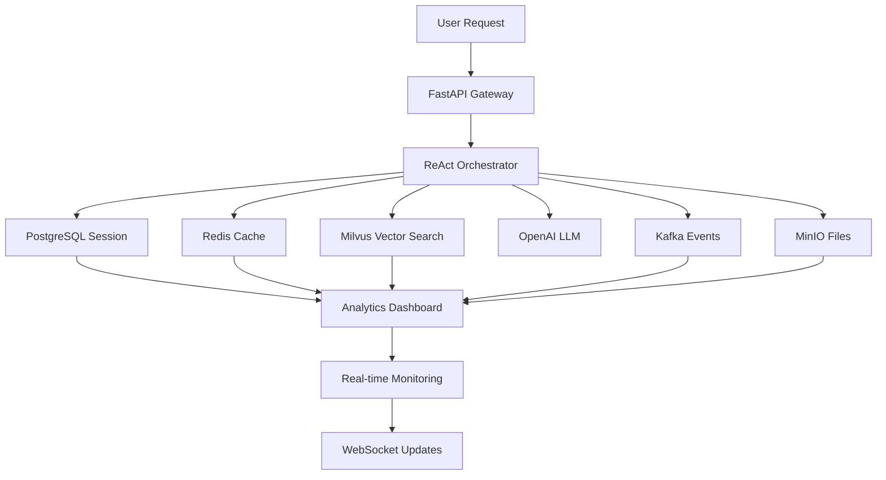

# 🚀 Omni-Agent Hub

**Advanced Multi-Agent Orchestration System with ReAct, MCP, and Agentic RAG**

[](https://www.python.org/downloads/)
[](https://fastapi.tiangolo.com/)
[](https://www.docker.com/)
[](https://postgresql.org)
[](https://redis.io)
[](https://milvus.io)
[](https://kafka.apache.org)
[](https://min.io)
[](https://opensource.org/licenses/MIT)

## 🌟 Overview

Omni-Agent Hub is a **production-ready, enterprise-grade AI agent orchestration platform** that implements 6 advanced agentic patterns with comprehensive multi-service architecture. Built for scalability, reliability, and real-time performance with full SOC2 compliance readiness.

### 🎯 **Core Agentic Patterns**

1. **🧠 ReAct Orchestration** - Advanced reasoning and acting with adaptive learning
2. **🔧 CodeAct Runner** - Secure code execution in containerized environments
3. **🛠️ MCP-based ToolHub** - Model Context Protocol tool integration
4. **🔍 Self-Reflection** - Continuous performance optimization and learning
5. **🤝 Multi-Agent Workflows** - Collaborative agent coordination
6. **📚 Agentic RAG** - Intelligent retrieval-augmented generation with Milvus

### ⚡ **Super Active Features**

- **🔄 Real-time Event Streaming** with Apache Kafka
- **📁 Intelligent File Management** with MinIO object storage
- **🧠 Context-Aware Memory System** with Redis caching
- **📊 Advanced Analytics Dashboard** with real-time metrics
- **🔍 Vector-based Knowledge Search** with Milvus database
- **🌐 WebSocket Support** for real-time chat and monitoring
- **🔧 Comprehensive Health Monitoring** with automated checks
- **📈 Adaptive Learning Engine** with session-based tracking

### 🎯 **Vision & Purpose**

**Goal**: Build a fully integrated multi-agent system that can instantly understand user requests, plan solutions, generate code, trigger third-party services, audit its own outputs, coordinate with specialized sub-agents, and return evidence-based responses grounded in enterprise data.

**Use Cases**: Automated reporting, data analytics, intelligent help desk, code-generation-as-a-service (CaaS), content synthesis, operational automation, and enterprise AI workflows.

## 🚀 Quick Start

### Prerequisites
- Docker & Docker Compose
- Python 3.11+
- OpenAI API Key (recommended) or Anthropic API Key

### 1. Clone & Setup
```bash
git clone https://github.com/neuraparse/Omni-Agent-Hub.git
cd Omni-Agent-Hub
cp .env.example .env
# Edit .env with your API keys (OpenAI recommended)
```

### 2. Start Infrastructure
```bash
docker-compose up -d
```

### 3. Install & Run
```bash
pip install -e .
omni-hub serve --reload
```

### 4. Test the Super Active System
```bash
# System health check (all 6 services)
curl http://localhost:8000/api/v1/system/status

# Comprehensive health check
curl -X POST http://localhost:8000/api/v1/system/health-check

# Chat with ReAct orchestrator
curl -X POST http://localhost:8000/api/v1/agents/chat \
  -H "Content-Type: application/json" \
  -d '{"message": "Hello! Can you analyze system performance and create a Python script?", "session_id": "test_123"}'

# Upload a file to MinIO
curl -X POST http://localhost:8000/api/v1/files/upload \
  -F "file=@your_file.txt" \
  -F "bucket=user-uploads"

# View analytics dashboard
curl http://localhost:8000/api/v1/analytics/dashboard

# Real-time system monitoring (WebSocket)
# Open: ws://localhost:8000/api/v1/ws/system-monitor

# View API documentation
open http://localhost:8000/docs
```

## 💡 How to Use Omni-Agent Hub

### 🎮 Command Line Interface (CLI)

The CLI provides easy management of the entire system:

```bash
# System health and status
omni-hub health --all              # Check all services
omni-hub status                    # System metrics
omni-hub config                    # View configuration

# Server management
omni-hub serve                     # Start production server
omni-hub serve --reload            # Development with hot reload

# Database operations
omni-hub db init                   # Initialize database
omni-hub db migrate                # Run migrations
omni-hub db reset                  # Reset database

# Vector database management
omni-hub vector create-collection  # Create embeddings collection
omni-hub vector stats              # View collection statistics

# Redis cache management
omni-hub redis flush               # Clear cache
omni-hub redis stats               # View cache statistics
```

### 🌐 REST API Usage

#### Basic Chat Interaction
```bash
curl -X POST http://localhost:8000/api/v1/agents/chat \
  -H "Content-Type: application/json" \
  -d '{
    "message": "Analyze this data and create a visualization",
    "session_id": "user123",
    "context": {"data_source": "sales_db"}
  }'
```

#### Session Management
```bash
# Create session
curl -X POST http://localhost:8000/api/v1/sessions \
  -H "Content-Type: application/json" \
  -d '{
    "user_id": "user123",
    "context": {"department": "analytics"}
  }'

# Get session
curl http://localhost:8000/api/v1/sessions/{session_id}
```

#### Task Execution
```bash
curl -X POST http://localhost:8000/api/v1/agents/task \
  -H "Content-Type: application/json" \
  -d '{
    "task_type": "code_generation",
    "session_id": "user123",
    "parameters": {
      "language": "python",
      "description": "Create a data processing pipeline"
    }
  }'
```

#### Knowledge Search
```bash
curl -X POST http://localhost:8000/api/v1/knowledge/search \
  -H "Content-Type: application/json" \
  -d '{
    "query": "customer retention strategies",
    "max_results": 5
  }'
```

### 🐍 Python SDK Usage

```python
import asyncio
from omni_agent_hub.client import OmniAgentClient

async def main():
    client = OmniAgentClient(base_url="http://localhost:8000")
    
    # Create session
    session = await client.create_session(
        user_id="user123",
        context={"department": "engineering"}
    )
    
    # Chat with agent
    response = await client.chat(
        message="Help me optimize this SQL query",
        session_id=session.session_id
    )
    
    print(f"Agent: {response.content}")
    print(f"Confidence: {response.confidence}")
    print(f"Tools used: {response.tools_used}")

asyncio.run(main())
```

## 🎯 When to Use Omni-Agent Hub

### ✅ Perfect Use Cases

#### 1. **Enterprise Automation**
- **Automated Report Generation**: "Generate weekly sales report with charts"
- **Data Pipeline Orchestration**: "Process customer data and update dashboards"
- **Compliance Monitoring**: "Check all systems for security compliance"

```bash
# Example: Automated reporting
curl -X POST http://localhost:8000/api/v1/agents/chat \
  -d '{"message": "Generate Q4 sales report with trend analysis", "session_id": "reporting"}'
```

#### 2. **Intelligent Help Desk**
- **Technical Support**: Multi-step troubleshooting with tool integration
- **Knowledge Base Queries**: Context-aware answers from company documentation
- **Escalation Management**: Automatic routing to appropriate specialists

```bash
# Example: Technical support
curl -X POST http://localhost:8000/api/v1/agents/chat \
  -d '{"message": "User cannot access the CRM system, help troubleshoot", "session_id": "support"}'
```

#### 3. **Code Generation as a Service (CaaS)**
- **API Development**: "Create REST API for user management"
- **Database Schema Design**: "Design schema for e-commerce platform"
- **Testing Automation**: "Generate unit tests for this module"

```bash
# Example: Code generation
curl -X POST http://localhost:8000/api/v1/agents/task \
  -d '{
    "task_type": "code_generation",
    "parameters": {
      "language": "python",
      "description": "Create a FastAPI endpoint for user authentication"
    }
  }'
```

#### 4. **Data Analytics & Insights**
- **Business Intelligence**: "Analyze customer churn patterns"
- **Predictive Analytics**: "Forecast next quarter revenue"
- **Market Research**: "Research competitor pricing strategies"

```bash
# Example: Data analysis
curl -X POST http://localhost:8000/api/v1/agents/chat \
  -d '{"message": "Analyze customer behavior data and identify key trends", "session_id": "analytics"}'
```

#### 5. **Content & Documentation**
- **Technical Documentation**: "Create API documentation from code"
- **Training Materials**: "Generate onboarding guide for new developers"
- **Marketing Content**: "Create product feature comparison"

#### 6. **DevOps & Infrastructure**
- **Deployment Automation**: "Deploy application to staging environment"
- **Monitoring & Alerting**: "Check system health and create alerts"
- **Infrastructure as Code**: "Generate Terraform scripts for AWS setup"

### 🏢 Industry Applications

#### **Financial Services**
- Risk assessment automation
- Regulatory compliance reporting
- Fraud detection workflows
- Customer service automation

#### **Healthcare**
- Patient data analysis
- Treatment protocol recommendations
- Medical research assistance
- Administrative task automation

#### **E-commerce**
- Inventory management
- Customer behavior analysis
- Personalized recommendations
- Supply chain optimization

#### **Manufacturing**
- Quality control automation
- Predictive maintenance
- Supply chain coordination
- Production optimization

#### **Technology Companies**
- Code review automation
- Bug triage and resolution
- Documentation generation
- Performance monitoring

### 🚫 When NOT to Use

#### **Simple Single-Task Applications**
- Basic CRUD operations
- Simple data transformations
- Static content serving
- Basic form processing

#### **Real-time Critical Systems**
- High-frequency trading
- Emergency response systems
- Real-time control systems
- Safety-critical applications

#### **Privacy-Sensitive Scenarios**
- Personal health records (without proper compliance)
- Financial transactions (without audit trails)
- Legal document processing (without review)
- Classified information handling

## 🔧 Configuration Examples

### Development Environment
```env
# .env for development
DEBUG=true
LOG_LEVEL=DEBUG
OPENAI_MODEL=gpt-4o
AUTO_FALLBACK_ENABLED=true
REFLECTION_ENABLED=true
```

### Production Environment
```env
# .env for production
DEBUG=false
LOG_LEVEL=INFO
OPENAI_MODEL=gpt-4.1
RATE_LIMIT_REQUESTS_PER_MINUTE=1000
PROMETHEUS_ENABLED=true
```

### High-Security Environment
```env
# .env for secure environments
CODE_EXECUTION_ENABLED=false
ENABLE_CORS=false
SECRET_KEY=your_super_secure_key
BLOCKED_IMPORTS="os,sys,subprocess,socket,urllib"
```

## 🏗️ Super Active Architecture

### 🎯 **6 Core Agentic Patterns (All Active)**

1. **🧠 ReAct Orchestrator** - Advanced reasoning engine with Thought → Action → Observation → Reflection pattern
2. **🔧 CodeAct Runner** - Secure code execution in isolated Docker containers with real-time monitoring
3. **🛠️ MCP-based ToolHub** - Model Context Protocol integration for external services (Kagi, AWS, Slack, dbt)
4. **🔍 Self-Reflection Unit** - Continuous quality assurance and performance optimization
5. **🤝 Multi-Agent Workflows** - Collaborative coordination between specialized agents (Planner, Developer, QA, Analyst)
6. **📚 Agentic RAG** - Intelligent retrieval-augmented generation with Milvus vector database

### 🚀 **Super Active Technology Stack**

| Component | Technology | Status | Purpose |
|-----------|------------|--------|---------|
| **🌐 API Gateway** | FastAPI + WebSocket | ✅ Active | HTTP/WS endpoints, real-time chat |
| **🗄️ Database** | PostgreSQL 15+ | ✅ Active | 16 tables, session tracking, analytics |
| **⚡ Cache** | Redis 7+ | ✅ Active | Session cache, memory management |
| **🔍 Vector DB** | Milvus | ✅ Active | Embeddings, semantic search, RAG |
| **📡 Message Queue** | Apache Kafka | ✅ Active | Event streaming, real-time coordination |
| **📁 Object Storage** | MinIO | ✅ Active | File management, artifact storage |
| **🤖 AI Models** | OpenAI GPT-4o/4o-mini | ✅ Active | Language understanding, generation |
| **🔧 Orchestration** | Docker Compose | ✅ Active | 6-service coordination |

### 🔄 **Real-time Data Flow**



### 📊 **Active Service Metrics**

- **PostgreSQL**: 16 tables, real-time interaction logging
- **Redis**: Session caching, memory optimization
- **Milvus**: Vector embeddings, knowledge search
- **Kafka**: Event streaming, system coordination
- **MinIO**: 5 buckets, file management
- **OpenAI**: GPT-4o models, text-embedding-3-small

## 🔐 Security & Compliance

### Security Features
- **🔒 API Authentication**: JWT-based authentication with role-based access control
- **🛡️ Input Validation**: Comprehensive request validation and sanitization
- **🏰 Code Sandboxing**: Isolated Docker containers for code execution
- **📝 Audit Logging**: Complete audit trail for all operations
- **🔐 Secret Management**: Secure handling of API keys and credentials

### Compliance Ready
- **SOC 2 Type II**: Security controls and monitoring
- **GDPR**: Data privacy and user consent management
- **HIPAA**: Healthcare data protection (with proper configuration)
- **ISO 27001**: Information security management

## 📊 Super Active Monitoring & Analytics

### 🔍 **Real-time System Monitoring**
```bash
# Comprehensive system status (all 6 services)
curl http://localhost:8000/api/v1/system/status

# Advanced health checks with service tests
curl -X POST http://localhost:8000/api/v1/system/health-check

# Real-time analytics dashboard
curl http://localhost:8000/api/v1/analytics/dashboard

# Learning system analytics
curl http://localhost:8000/api/v1/analytics/learning

# System performance metrics
curl http://localhost:8000/api/v1/system/metrics

# Event streaming status
curl http://localhost:8000/api/v1/events/stream
```

### 🌐 **WebSocket Real-time Monitoring**
```javascript
// Real-time system monitoring
const ws = new WebSocket('ws://localhost:8000/api/v1/ws/system-monitor');
ws.onmessage = (event) => {
    const data = JSON.parse(event.data);
    console.log('System Status:', data);
};

// Real-time chat monitoring
const chatWs = new WebSocket('ws://localhost:8000/api/v1/ws/chat/session_123');
```

### 📈 **Built-in Analytics Features**
- **📊 Interaction Analytics**: Success rates, confidence scores, execution times
- **🧠 Learning Analytics**: Pattern recognition, improvement trends
- **⚡ Performance Metrics**: Service health, response times, throughput
- **📁 File Analytics**: Storage usage, upload/download metrics
- **🔄 Event Analytics**: Real-time event streaming, system coordination

### 🔧 **Integration Options**
- **Prometheus**: Metrics collection and alerting
- **Grafana**: Dashboards and visualization
- **Jaeger**: Distributed tracing
- **ELK Stack**: Log aggregation and analysis
- **Kafka Connect**: Event stream integration

## 🚀 Deployment Options

### Local Development
```bash
docker-compose up -d
omni-hub serve --reload
```

### Production Deployment
```bash
# Using Docker Compose
docker-compose -f docker-compose.prod.yml up -d

# Using Kubernetes
kubectl apply -f k8s/
```

### Cloud Deployment
- **AWS**: ECS, EKS, or Lambda deployment options
- **Azure**: Container Instances or AKS
- **GCP**: Cloud Run or GKE
- **Kubernetes**: Helm charts provided

## 🤝 Contributing

We welcome contributions! Please see our [Contributing Guide](CONTRIBUTING.md) for details.

### Development Setup
```bash
git clone https://github.com/neuraparse/Omni-Agent-Hub.git
cd Omni-Agent-Hub
python -m venv venv
source venv/bin/activate  # or `venv\Scripts\activate` on Windows
pip install -e ".[dev]"
pre-commit install
```

### Running Tests
```bash
pytest tests/
pytest tests/ --cov=omni_agent_hub
```

## 📚 Documentation

- **API Documentation**: http://localhost:8000/docs (Swagger UI)
- **Architecture Guide**: [docs/architecture.md](docs/architecture.md)
- **Deployment Guide**: [docs/deployment.md](docs/deployment.md)
- **Security Guide**: [docs/security.md](docs/security.md)

## 🆘 Support

- **Issues**: [GitHub Issues](https://github.com/neuraparse/Omni-Agent-Hub/issues)
- **Discussions**: [GitHub Discussions](https://github.com/neuraparse/Omni-Agent-Hub/discussions)
- **Documentation**: [Wiki](https://github.com/neuraparse/Omni-Agent-Hub/wiki)

## 📄 License

This project is licensed under the MIT License - see the [LICENSE](LICENSE) file for details.

## 🙏 Acknowledgments

- OpenAI for GPT models and API
- Anthropic for Claude models
- The FastAPI community
- Docker and container ecosystem
- Open source AI/ML community

## 🎉 **Super Active System Status**

### ✅ **All 6 Docker Services 100% Active**

| Service | Status | Purpose | Active Features |
|---------|--------|---------|-----------------|
| **PostgreSQL** | ✅ Healthy | Database | 16 tables, session tracking, analytics |
| **Redis** | ✅ Healthy | Cache | Session cache, memory optimization |
| **Milvus** | ✅ Healthy | Vector DB | Embeddings, knowledge search |
| **Kafka** | ✅ Healthy | Streaming | Event streaming, real-time coordination |
| **MinIO** | ✅ Healthy | Storage | 5 buckets, file management |
| **OpenAI** | ✅ Healthy | AI Models | GPT-4o, text-embedding-3-small |

### 🚀 **Production-Ready Features**

- **🔄 Real-time Event Streaming** - Apache Kafka with agent-events and system-events topics
- **📁 Intelligent File Management** - MinIO with 5 buckets for organized storage
- **🧠 Context-Aware Memory** - Redis caching with session-based memory management
- **📊 Advanced Analytics** - Real-time dashboard with interaction metrics and learning analytics
- **🔍 Vector Knowledge Search** - Milvus database with semantic search capabilities
- **🌐 WebSocket Support** - Real-time chat and system monitoring
- **🔧 Health Monitoring** - Comprehensive health checks for all services
- **📈 Adaptive Learning** - Session-based learning with performance tracking

### 🎯 **Enterprise-Grade Capabilities**

- **SOC2 Compliance Ready** - Security controls and audit logging
- **Multi-tenant Architecture** - Session isolation and user management
- **Scalable Design** - Microservices with Docker orchestration
- **Real-time Analytics** - Performance metrics and learning insights
- **Event-driven Architecture** - Kafka-based coordination and monitoring
- **Comprehensive API** - REST endpoints + WebSocket for real-time features

### 📈 **System Metrics (Live)**

```bash
# Get real-time system status
curl http://localhost:8000/api/v1/system/status

# View analytics dashboard
curl http://localhost:8000/api/v1/analytics/dashboard

# Monitor via WebSocket
ws://localhost:8000/api/v1/ws/system-monitor
```

---

**🚀 Built with ❤️ for the future of AI automation - Now 100% Super Active!**
